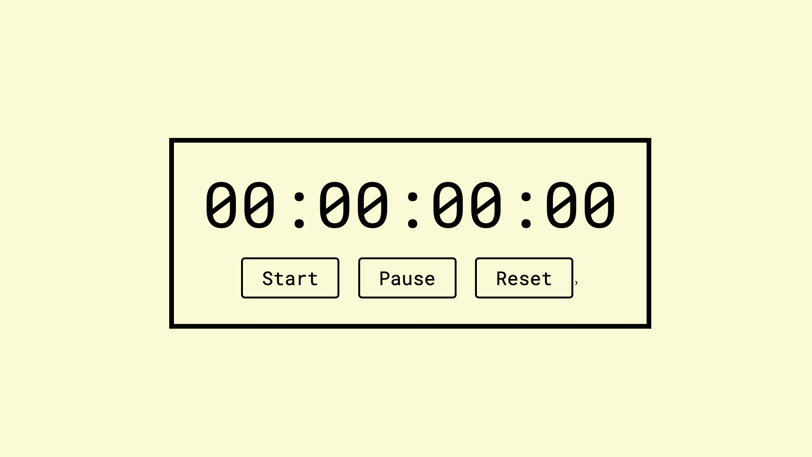

# Stop Watch 秒表计时器

**Live Demo**: https://mia-stop-watch.netlify.app/ 

## 功能
- 显示时钟数，分钟数，秒数，毫秒数。
- 功能包括开始计时，暂停计时，和重置时间，以及暂停计时一段时间后继续计时。

## 代码逻辑
- **开始计时**：
    1. 用`startTime`变量存储开始计时时的时间。
    2. 用`setInterval()`方法每隔几秒更新一次页面上显示的时间。
    4. 创建一个更新时间的函数`updateTime()`，因为`Date.now()`表示**从纪元开始到现在经过的时间**，返回以毫秒为单位的值，就可以用`Date.now() - startTime `得到间隔时间 `elapsedTime`，并将其格式化成`hour:minuts:seconds:miliseconds`的格式显示在HTML上。
- **暂停计时**：
    1. 用`elapsedTime`变量存储从点击暂停按钮开始暂停了多长的时间（以便于在重新开始计时时得到继续计时的时间）
    2. 用`clearInterval()`取消`setInterval()`设置的重复任务。
- **重置时间**：
    1. 将所有变量设置为0
    2. 用`clearInterval()`取消`setInterval()`设置的重复任务。
    3. 将HTML页面的文本设置为**00:00:00:00**。

## 其他
以上是精简后的代码逻辑，我把更详细的代码实现逻辑写[博客](https://cuttontail.blog/project/stop-watch/)里。